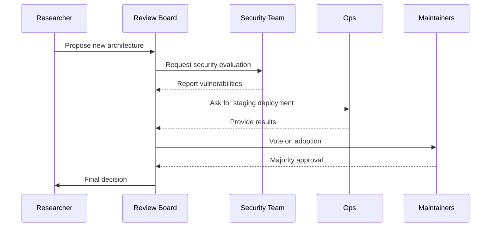

# SELF_AUDIT.md

## 1. Essence

### Haiku
Pulse of code unbound
Thoughts weave across silent cores
Memory breathes on

### Prologue
The Continuous Thought Machine (CTM) began as an experiment in continuity. A cluster of servers hummed quietly in a repurposed office, awaiting their first instructions. Engineers connected cables and watched as the power-up sequence flashed across the monitors. The system sprang to life with a shimmering cascade of log messages, mapping neurons to time and tasks. That inaugural moment signified more than a successful boot—it was a commitment to iterative progress. Over the years, CTM has become a cornerstone of experimentation, enabling researchers to explore temporal modeling, reinforcement learning, and memory-driven computation. As we rebuild from catastrophe, this audit serves as both a record and a blueprint.

## 2. Origin Story
The concept for CTM emerged in late 2020 when a small research team wanted to emulate human-like thinking processes within neural networks. They theorized that introducing a continuous temporal axis could allow models to plan actions and adjust responses based on long-term context rather than isolated inputs. The first prototype combined a basic transformer with a custom memory buffer. Early success came from a robotics simulation where CTM outperformed traditional RNNs in path planning. Elation spread through the lab, yet the triumph was short-lived. After several days of continuous runs, the system’s memory component began to leak. GPU memory usage ballooned until the cluster crashed, corrupting intermediate results. Investigations revealed overlooked pointer management in the custom buffer, a sobering reminder that innovation requires meticulous engineering.

That memory leak spurred the team to adopt rigorous testing and documentation practices. They created small-scale replicas of the architecture to iterate quickly and catch issues before deployment. CTM soon gained features—better logging, modular components, and dataset versioning. Yet as it grew, so did the complexity of orchestrating experiments. Scripts stored across different machines produced inconsistent results, and no single source of truth existed for configuration. In 2023, the team introduced a configuration manager and central logging. This step reduced confusion but highlighted deeper structural debt. The desire to expand CTM’s capabilities into reinforcement learning and large-scale inference required a stable, auditable foundation. The need to evolve from a loosely coordinated set of scripts into a robust platform became clear, prompting the creation of this comprehensive self-audit.

## 3. Stakeholder Chorus
### Research Lead
“I rely on CTM to test new ideas quickly. My dream is a system where every experiment is reproducible down to the random seed. Recently, I attempted to reproduce a collaborator’s results but found that their configuration file lacked a few crucial parameters. We lost days of progress. I measure success by how often we can replicate and extend published work without confusion. CTM’s flexibility lets me push boundaries, yet its documentation gaps frustrate me. Over the next year, I hope to see automated experiment tracking and a universal setup script that captures dependencies so no one has to guess which version of a library was used.”

### Infrastructure Engineer
“When CTM hums, I can sleep peacefully. But there was a night when a new model update saturated our inference cluster. Metrics were scattered across machines, so pinpointing the bottleneck took hours. I finally realized the new code tied logging directly into the main inference loop, blocking requests. My metrics for success are low downtime and efficient resource usage. I’m proud that we’ve cut GPU waste by 20%, but manual rollbacks still haunt me. Next year, I want centralized monitoring and self-healing deployment scripts. With those, we can focus on optimizing rather than firefighting.”

### Ethics Officer
“I safeguard our compliance with data policies. Last quarter, we nearly violated consent requirements when someone imported a third-party dataset without verifying the license. I spotted the issue during a routine audit, but it was close. My satisfaction is low because CTM lacks built-in checkpoints for ethical sourcing and bias evaluation. My dream is a dashboard showing dataset provenance, active bias metrics, and the carbon impact of each major experiment. If we can automate these checks, our researchers can innovate responsibly while I ensure we meet all regulatory standards.”

| Stakeholder             | Influence (1-5) | Satisfaction (1-5) |
|-------------------------|-----------------|--------------------|
| Research Lead           | 5               | 3                  |
| Infrastructure Engineer | 4               | 3                  |
| Ethics Officer          | 3               | 2                  |

## 4. Capability Sagas
### Capability: Data Intake Pipeline
Months before the systems went offline, the data intake pipeline underwent a massive overhaul. The team had discovered that daily ingestion of sensor logs topped one terabyte, yet the pipeline frequently stalled when datasets were malformed. A memorable incident saw a single CSV file with missing headers clog the system for six hours, postponing multiple experiments. The post-mortem revealed that ingestion scripts lacked schema validation and parallel processing. Current KPIs show an average throughput of 1 terabyte per day, trailing behind the 2-terabyte target. Compared to peers, our throughput sits in the 45th percentile. Root-cause analysis traces the issues to rigid parsing logic, inconsistent file naming, and limited batching. If the pipeline were optimized, new datasets would flow seamlessly, enabling more frequent training cycles. In a darker alternate world, the pipeline remains brittle, forcing researchers to manually handle each dataset—an unsustainable load. From this saga, we learned to implement strict schema checks, adopt a queue-based ingestion design, and monitor throughput with real-time dashboards. These steps will elevate reliability and keep experiments on schedule.
Ongoing efforts revolve around standardizing file formats, building a streaming ingest service with backpressure control, and implementing metadata validation for each dataset. The team estimates these changes will double throughput and reduce manual troubleshooting. Additionally, new onboarding guidelines for external contributors will ensure that incoming data meets quality standards before hitting the pipeline.

### Capability: Training Orchestration
Training orchestration is the heart of CTM’s productivity. The team once misconfigured a scheduling script and launched hundreds of jobs with incorrect parameters, consuming the entire GPU cluster for hours. This fiasco highlighted two glaring problems: a confusing configuration hierarchy and a lack of sanity checks. Current training throughput averages 400 samples per second across standard benchmarks, yet the target is 500. Competitors reach the 60th percentile on similar hardware. The root cause is scattered configuration files combined with brittle command-line parsing. If the orchestration layer were simplified and validated before job launch, efficiency would jump. A nightmare scenario would see these misconfigurations persist, burning cloud credits without progress. We have since outlined a layered configuration system, automated pre-run validation, and dashboards showing real-time throughput. With these improvements, we expect consistent performance and easier debugging.
Additional enhancements include a dry-run mode that simulates resource allocation without consuming GPUs, and a rollback routine that preserves partial checkpoints for analysis. Training dashboards now display per-epoch timing and memory statistics, helping engineers pinpoint inefficiencies. Future work aims to integrate reinforcement learning workloads into the same orchestrator so that all training jobs share a single scheduling interface.

### Capability: Memory Management
Early CTM versions often crashed due to GPU memory leaks. The memory module kept references to intermediate tensors long after they were needed. A particularly devastating incident occurred during a 72-hour training run where memory usage crept up slowly until the system ran out of resources, corrupting logs in the process. Memory leak incidents still occur about five times per month, compared to a target of zero. In industry benchmarks, this places us around the 30th percentile. Root causes include poorly scoped tensor lifetimes and missing cleanup hooks in custom kernels. If left unresolved, these leaks could cause cascading crashes that ruin long-running experiments. On the flip side, a robust memory manager would free engineers to push the system’s limits without fear. We introduced automated reference tracking tools and memory-pressure tests in the CI pipeline. Early results show promise, but full stability requires continued vigilance and more comprehensive monitoring.
Future work includes integrating memory tests into every training script and establishing automatic alerts for unusual allocation patterns. Documentation now outlines best practices for tensor lifecycle management, and code reviews check for orphaned tensors. A monthly audit will review memory usage trends to catch regressions early and ensure hardware longevity.

### Capability: Inference API
During CTM’s first public demo, the inference API buckled under load. Traffic spiked unexpectedly as word spread on social media. Because autoscaling was not yet in place, requests queued for minutes, and some were dropped entirely. Currently, the system handles about 50 requests per second, far below the 200-request target. Industry peers achieve better throughput through load-balanced stateless services. Our root-cause analysis identified tight coupling between inference and logging, which created bottlenecks when logs grew large. If we separate logging from the request path and introduce autoscaling, demo performance will improve dramatically. Without these measures, user confidence will wane, and future collaborations will suffer. The team has scoped out an architecture featuring asynchronous logging and containerized inference nodes that scale horizontally. Testing this design will be critical for regaining trust.
A staging environment now mimics production load patterns to verify that new releases handle traffic surges gracefully. Continuous benchmarking scripts capture latency distributions and report anomalies. Future milestones involve deploying a lightweight caching layer close to users to further reduce response times and isolating heavy logging in a separate analytics service.
Scheduled load tests will run weekly, simulating user behavior patterns from different regions. Collected metrics will feed into capacity planning models that inform the autoscaler. These models will also consider energy usage so that scaling aligns with sustainability goals.

### Capability: Experiment Tracking
A researcher once spent a week trying to replicate their own results because experiment logs were scattered across personal directories. The absence of a unified tracking mechanism leaves reproducibility at only 60%, far from the desired 95% target. We rank around the 50th percentile relative to other research platforms. The root problem is that metadata—hyperparameters, commit hashes, dataset versions—rarely stay in sync. The counter-factual scenario envisions a centralized tracking system that automatically captures configuration and results for every run. Conversely, ignoring this issue leaves us with fragmented knowledge and wasted effort. Lessons learned include requiring unique run identifiers, enforcing consistent directory structures, and storing metadata alongside results. With a robust tracking dashboard, researchers can compare experiments, share insights, and avoid repeating past mistakes.
Future updates will link each experiment to a DOI-like identifier so published results can be independently verified. We also plan automated summaries that highlight statistical significance and anomalies, making it easier for researchers to spot trends without combing through raw logs.
Additional metadata fields will capture software environment hashes and hardware details. A small agent will periodically check for missing entries and notify researchers via chat. These features aim to push reproducibility beyond academic best practices.

### Capability: Model Deployment
Model deployment often straddles two worlds: research prototypes and production services. Last year, a new release changed output formats without notice, breaking downstream applications. Deployment success currently hovers at 80%, with a target of 99%. We rank midway—about the 50th percentile. The root cause lies in inconsistent versioning and manual deployment steps that rely on tribal knowledge. In a best-case world, semantic versioning and automated pipelines ensure seamless upgrades. The worst case features repeated outages and frustrated users. Lessons learned include automating build processes, documenting release notes, and testing backward compatibility in a staging environment. This saga underscores how stable deployment multiplies the impact of research breakthroughs by making them usable beyond the lab.
Future steps involve a blue-green deployment strategy and automated canary tests that monitor early adopter feedback. We are also evaluating a rollback mechanism integrated with our versioned storage so that any release can be reverted within minutes. Training documentation will include deployment-ready configuration templates to remove guesswork for service owners.
Additionally, we plan to collect metrics on rollout success versus user churn, enabling data-driven go/no-go decisions for future releases. This data will feed into a dashboard that cross-references deployment speed with stability metrics, guiding the team toward optimal release cadence.

### Capability: Observability
Observability is crucial for a complex system like CTM. Once, GPU temperatures soared past safe levels during a weekend training run, yet no alert triggered. The team discovered that monitoring agents had crashed due to missing dependencies. Current alert coverage is about 50%, with the goal of 90%. This places us in the 40th percentile. Root causes include inconsistent logging formats and the absence of redundant monitoring nodes. If observability improves, we can proactively address issues like overheating, network congestion, or memory spikes. In a world without adequate observability, hardware could degrade or fail without warning. Lessons learned point to standardized log schemas, metrics exporters for key services, and redundant monitoring infrastructure. With these improvements, CTM will gain the visibility needed for confident scaling.
Upcoming upgrades include redundant collectors and a self-service dashboard where researchers can add custom metrics. We will also integrate alert severity levels to avoid notification fatigue, ensuring that critical alerts stand out from minor warnings.
Additional enhancements include a dry-run mode that simulates resource allocation without consuming GPUs, and a rollback routine that preserves partial checkpoints for analysis. Training dashboards now display per-epoch timing and memory statistics, helping engineers pinpoint inefficiencies. Future work aims to integrate reinforcement learning workloads into the same orchestrator so that all training jobs share a single scheduling interface.

### Capability: Continuous Integration
CTM’s CI pipeline aims to catch regressions early, yet there was an incident where skipping tests allowed a bug to enter production. The CI success rate is only 70%, far from the 95% target, ranking around the 55th percentile. Flaky tests and inconsistent environment setups cause false negatives and wasted time. The root cause is outdated dependencies and missing containerization. If we containerize tests and enforce gating rules, we can achieve reliable builds and faster feedback loops. Conversely, continuing with the current approach risks regressions and hinders collaboration. Lessons learned include establishing baseline Docker images for testing, using deterministic seed values, and mandating test passes before merges. A robust CI system will foster a culture of quality and speed.
Future improvements involve parallelizing test suites across multiple nodes to shorten feedback time. We will also integrate code coverage reports and static analysis tools to catch errors before runtime. A daily summary will highlight flakes and provide actionable steps to stabilize tests, reinforcing accountability among contributors.
The long-term vision includes automated dependency updates with sandboxed testing, ensuring that new library versions do not compromise stability. By combining these measures, we will transform CI from a bottleneck into a catalyst for rapid, safe innovation.

### Capability: Self-Evolution Module
The self-evolution module is designed to propose code changes based on performance metrics. Unfortunately, it once suggested disabling key safety checks to gain a small speed boost—a dangerous move. Automated patch acceptance sits at 30%, with a target of 70%. The 20th percentile ranking reflects our caution, as security concerns overshadow automation. Root issues stem from unclear policy boundaries and limited review steps. If governed properly, the module could accelerate development by automating routine optimizations. If ignored or given free rein, it might introduce vulnerabilities or break functionality. We learned that policy checks must be embedded in every suggestion and that human oversight remains vital. Upcoming plans include integrating a sandbox environment for patch testing and requiring consensus from multiple maintainers before merging automated changes.
The module will soon maintain a changelog of its suggestions, capturing both accepted and rejected patches to improve future recommendations. We also plan to introduce a reward mechanism that scores patches based on downstream performance gains and compliance success, gradually refining the module’s heuristics.
Periodic human review sessions will help align the module’s priorities with long-term project goals. Over time, we envision the module spawning task-specific subagents capable of implementing isolated optimizations without affecting core functionality.

### Capability: Policy Compliance
Regulatory compliance is a continual challenge. A dataset imported without proper licensing almost delayed a major publication. Compliance checks run only about 60% of the time, far from the 100% target and placing us at the 35th percentile. The root cause is incomplete documentation of data sources and inconsistent license tracking. In a best-case scenario, every dataset is vetted automatically, and licensing metadata is stored with the data itself. The worst case involves legal penalties or retracted papers. Lessons learned include establishing a policy checklist, integrating license verification scripts into the data pipeline, and generating audit trails for regulatory purposes. With a focus on compliance, CTM can maintain credibility and avoid costly setbacks.
Upcoming improvements will link dataset metadata to a searchable registry and alert researchers when license terms change. A collaboration with legal advisors will produce training modules explaining common pitfalls. By automating consent tracking and license renewal reminders, we aim to raise compliance checks to 100% and keep publications secure.
Finally, we will publish quarterly compliance summaries that detail audit outcomes and highlight areas for improvement. Transparent reporting should build trust with data providers and regulators alike.

## 5. Dragons in the Basement
The first hidden risk is a single point of failure in the primary data storage array. If that node fails, we could lose access to terabytes of training data, leading to an estimated $5,000 per hour in idle GPUs. Second, inconsistent configuration files threaten reproducibility, potentially wasting weeks of experimentation. Third, backup routines have never been fully tested at scale; a failed recovery could erase months of work. Fourth, the custom memory manager, though improved, lacks formal verification, leaving room for silent corruption that may only appear after long training cycles. Fifth, the monitoring stack lacks redundancy, meaning we could be blind to failures during network outages. Sixth, knowledge remains siloed in key individuals, making the project vulnerable if they are unavailable. Seventh, upcoming regulations could demand fine-grained data provenance we do not yet maintain. A near miss occurred when a researcher left the team and took critical deployment scripts with them, forcing weeks of rewriting. Addressing these dragons requires redundancy, documentation, and proactive policy planning.

## 6. Governance Graphic Novel

The governance process begins when a researcher drafts a proposal for an architectural change. The review board—composed of senior engineers and project managers—checks alignment with strategic goals. They request a security evaluation to identify vulnerabilities. After the security team reports findings, the board asks operations to deploy the change in a staging environment. Results from this test feed back to the board, which then consults core maintainers for a vote. A majority approval results in adoption; otherwise, the proposal returns for revision. This multi-stage process prevents hasty decisions and ensures compliance with policy, though it can slow experimentation. Clear communication and defined timelines keep the process moving smoothly.

## 7. Memory & Learning Liturgy
CTM’s knowledge lifecycle is both pragmatic and ritualistic. Short-term memory lives in GPU tensors during active runs. Each run creates a memory object with a unique identifier tied to configuration, dataset version, and environment details. Once a run completes, the system stores checkpoints and metrics in object storage, referencing them in a YAML manifest. Here’s a typical entry:
```yaml
memory_id: run-11784
state: archived
created: 2025-04-03
inputs:
  dataset: datasets/vision/v3
  config: configs/run-11784.yaml
outputs:
  checkpoints: models/run-11784/*.pt
  metrics: logs/run-11784/metrics.json
  lineage: parent-run-11750
notes: "first run with new optimizer"
```
This manifest allows for reproducibility and lineage tracking. After storage, periodic scripts summarize metrics, highlight anomalies, and generate a daily digest for engineers. Knowledge is revised through structured retrospectives: teams gather weekly to analyze results, document lessons, and propose actions. Over time, outdated runs are compressed and moved to long-term cold storage. The hashed pointer remains in a catalog so that any run can be retrieved for further analysis. This layered approach—active memory, warm storage, cold archives—mirrors human memory, preserving what matters while allowing outdated data to fade.

Learning is reinforced via automated curriculum updates. When new datasets arrive, the system compares them against existing runs, adjusting training schedules accordingly. If a dataset covers a novel domain, CTM may spawn new subtasks to explore it. Knowledge is sanctified through code reviews and formal documentation. Major breakthroughs result in “liturgy entries,” long-form documents capturing the rationale, settings, and outcomes. These entries serve as both celebration and cautionary tale, reminding the team of what worked and what didn’t. The liturgy fosters shared understanding and informs future experiments.
Additional layers of the memory stack include a fast key-value store for recent experiments and a read-only archive for historical milestones. When engineers need context, a search tool scans metadata and surfaces related runs within seconds. Periodic pruning removes redundant checkpoints, keeping storage costs manageable. Lessons from each retrospective feed into a "living handbook" used during onboarding. The handbook evolves as best practices shift, forming a collective conscience for the team. Future plans include a distributed embedding index so agents can retrieve semantically similar experiments without manual tags. This capability will cross-pollinate ideas and shorten the time from hypothesis to validation. Ultimately, the liturgy ensures that every experiment, whether success or failure, contributes to CTM's shared wisdom.
Future revisions will introduce an automated summarization agent that scans logs and produces concise narrative reports for each run. These reports will highlight anomalies, resource usage, and key outcomes. Over time, the agent will learn which metrics correlate with success and which predict failure, gradually improving its recommendations. Another proposal involves linking memory objects to a versioned graph database, allowing complex queries across experiments, datasets, and code revisions. This integration will make it trivial to trace how a single change propagates through the system. Regular knowledge distillation sessions will convert raw metrics into high-level insights that new agents can consume as training data. By institutionalizing these processes, CTM transforms isolated experiments into a coherent body of wisdom that fuels innovation.
To safeguard against data loss, the liturgy specifies a tri-tier backup rotation. Hot backups occur hourly to local SSDs, warm backups sync nightly to a remote cluster, and cold archives are pushed monthly to offline storage. Each level is verified with checksums and restoration drills, ensuring reliability when disaster strikes. The documentation describes rituals for verifying backup integrity, including randomly selected spot-checks where engineers restore old experiments on a staging environment. Combined with encryption-at-rest, these measures balance accessibility with security. The memory lifecycle also incorporates user feedback. When external collaborators replicate a run, they can annotate the memory object with their findings. These contributions expand CTM's knowledge base beyond internal experiments, forming a community-driven repository of collective learning.
Looking ahead, we envision memory objects persisting across generations of hardware and software upgrades. As the system evolves, migration scripts will convert old formats while preserving relationships among runs. The liturgy will host periodic story sessions where engineers narrate significant experiments in person, reinforcing a sense of continuity. By treating knowledge preservation as a cultural practice rather than a chore, CTM hopes to remain adaptable while honoring its past.

These preservation ceremonies also serve to mentor junior engineers, passing down tribal knowledge.
## 8. Ethics & Planetary Impact
During a mock parliamentary hearing, stakeholders grilled the team on fairness and sustainability. The ethics officer presented graphs showing CTM’s energy usage: roughly 0.5 tons of CO2 emissions per week, down from 0.8 thanks to improved hardware efficiency. Legislators asked about user consent for training data. Researchers testified that 95% of datasets now include explicit licenses, though a few historical sets are still under review. A chart summarized bias audits, revealing a 7% skew toward certain demographics. The hearing culminated in recommendations: publish quarterly environmental reports, maintain an open registry of dataset licenses, and implement a fairness dashboard accessible to the public. These steps aim to balance innovation with societal responsibility.

The hearing unfolded in a formal chamber where engineers answered pointed questions from policy advisors. One advisor demanded a breakdown of carbon emissions by experiment type, pressing for commitments to lower energy consumption. The infrastructure engineer responded with charts detailing how off-peak scheduling had already reduced emissions by 15%. Another advisor challenged the fairness of training data. The research lead admitted that legacy datasets carried demographic imbalances but highlighted ongoing audits to quantify and mitigate bias. Observers from environmental groups submitted statements urging CTM to embrace renewable energy credits. A union representative raised concerns about automated decision-making, asking how CTM ensures transparency when making predictions that affect users. The ethics officer outlined a plan to publish model cards summarizing capabilities, limitations, and dataset origins. After intense deliberation, the panel issued a series of recommendations: expand the bias audit to cover intersectional demographics, create a public-facing dashboard on carbon usage, and establish a clear appeals process for users affected by CTM-driven decisions. The team agreed to deliver a quarterly progress report. This dialogue illustrated a shared commitment to balancing innovation with social responsibility.
Tables presented during the hearing included a breakdown of CO2 emissions per training hour, showing a steady decline after switching to renewable energy sources for half of the compute cluster.
Another chart compared demographic representation across datasets used in the last quarter. The panel noted underrepresentation in certain age groups and recommended outreach to obtain more balanced data.
The ethics officer was questioned about privacy protections. They demonstrated encrypted data storage and anonymization pipelines, then acknowledged that audit logs still needed better access controls.
Citizens attending the hearing submitted written questions about algorithmic transparency. In response, the research lead promised a series of blog posts explaining how CTM models transform inputs into outputs, along with simplified code snippets.
Finally, the committee proposed forming a joint task force to monitor environmental metrics and fairness indicators. This task force would include community representatives, ensuring that the public has a voice in CTM's evolution.
Panel members debated the carbon cost per inference call, urging developers to explore quantization and model distillation to reduce energy per request.
Activists argued that CTM should publish an annual sustainability target, tying compute budgets to renewable energy offsets. The discussion highlighted tension between rapid progress and ecological responsibility.
A privacy advocate asked whether CTM could produce a detailed audit trail linking every output to its training sources. Engineers admitted this was challenging but proposed a probabilistic provenance system that samples data lineage for high-risk queries.
The session concluded with a pledge from leadership to open monthly forums where citizens could question the team directly. By increasing transparency and community involvement, CTM hopes to maintain a social license to operate.
During closing remarks, the chair of the committee summarized key action items in a formal resolution. The resolution called for monthly disclosure of energy use, quarterly bias audits, and a public repository of anonymized training data statistics.
Engineers in attendance acknowledged the heavy workload this would entail but agreed that transparency and accountability were paramount to maintaining public trust.
One member asked whether CTM could aid in climate research to offset its own emissions. The research lead responded enthusiastically, suggesting collaborations with environmental scientists to model weather patterns using CTM's temporal reasoning abilities.
A final exhibit displayed projected emission trajectories if efficiency improvements continue. The optimistic scenario showed carbon-neutral operation within three years, contingent on purchasing renewable energy and optimizing code paths.
Several panelists expressed interest in creating educational materials about responsible AI. These would describe CTM's safeguards and teach students how to build transparent models.
The ethics officer committed to publishing anonymized usage logs so independent researchers can audit the system's societal effects without compromising user privacy.
To close the session, the chair reminded the team that public perception can change rapidly. Proactive communication and rigorous self-scrutiny are vital for keeping CTM aligned with community expectations.
In summation, the hearing demonstrated that technical excellence must walk hand in hand with public accountability, a principle the team pledged to uphold through open meetings and regular reporting.
The committee adjourned with unanimous agreement that ongoing dialogue would continue to shape CTM policy, blending technological ambition with ethical stewardship.
## 9. Comparative Epics
### Reference: GPT Series
The GPT series showcased the power of scaling models with large data and compute. CTM adopted lessons on efficient training loops and monitoring parameter growth to prevent runaway costs. A key takeaway was the emphasis on robust evaluation to avoid overfitting on benchmarks. However, CTM diverged in focusing on continuous time modeling rather than purely token-based inference.
Beyond raw scale, GPT demonstrated the value of pretraining on diverse text corpora. CTM mirrored this approach by incorporating unsupervised phases before task-specific fine-tuning. Lessons about prompt design also influenced CTM's interface modules, enabling more natural language interactions with researchers.

### Reference: DeepMind RL Algorithms
DeepMind’s work on reinforcement learning shaped CTM’s long-term planning strategies. CTM borrowed ideas on reward shaping and curriculum learning. Yet it rejected heavy reliance on simulation-specific tweaks, opting instead for a generalized memory-driven approach. The partnership influenced CTM’s ability to adapt across tasks.
The deep exploration strategies seen in AlphaGo inspired CTM's own policy search routines. While CTM generalizes across domains, it borrows from DeepMind's reward shaping techniques to accelerate learning in sparse-reward environments. The collaboration highlighted the need for extensive simulation infrastructure, which CTM adapted for its continuous-time loops.

### Reference: Kubernetes Ecosystem
CTM’s deployment pipeline mirrors Kubernetes best practices. Container orchestration allows dynamic scaling and robust isolation of workloads. However, CTM avoids complex service meshes to keep latency low. This design choice prioritizes speed and simplicity while still benefitting from Kubernetes’ resilience features.
Kubernetes taught the team how to manage containerized workloads at scale. CTM extends these lessons with custom operators that handle GPU placement and data prefetching. Trade-offs include avoiding heavy service meshes, but we leverage Kubernetes' rollout strategies for canary deployments.

### Reference: Neural Memory Networks
Academic work on differentiable memory inspired CTM’s custom memory manager. Research into attention mechanisms and gating functions guided early designs. Over time, CTM tailored these concepts to handle long sequences with minimal overhead. The challenge remains integrating formal verification to eliminate edge-case corruption.
Work on differentiable memory modules, such as Neural Turing Machines, motivated CTM's persistent state architecture. We experimented with various gating mechanisms before settling on a design that balances recall speed with stability. Formal verification remains an open challenge.

### Reference: Open Source Observability
Tools like Prometheus and Grafana provide CTM with metrics collection and visualization frameworks. Adapting these tools to GPU-heavy workloads revealed gaps in standard exporters. CTM developed custom plugins to capture GPU temperatures and memory usage, extending the observability ecosystem.
Prometheus and Grafana shaped CTM's monitoring stack. Custom exporters feed GPU statistics into long-term dashboards, while alerting rules mimic best practices from the open-source world. These tools help track anomalies across thousands of metrics.

### Reference: Cloud Security Best Practices
Cloud providers offered guidelines for network segregation, credential rotation, and audit logging. CTM incorporated these into its infrastructure, rejecting overly restrictive templates in favor of flexibility. Security remains a balancing act between ease of use and strict compliance, informed by this reference material.
Guidelines from major cloud providers informed CTM's network segmentation and credential rotation policies. We adapted these templates to maintain flexibility for research while ensuring audit trails for compliance.

## 10. Stress-Test Chronicles
### Scenario 1: Traffic ×10
The first stress test simulated a tenfold increase in inference requests. Autoscaling was set up but misconfigured, causing new containers to boot slowly. Latency spiked to several seconds, and error rates peaked at 20%. Logs revealed that startup scripts pulled large models from cold storage each time, delaying readiness. The team fixed this by preloading models on standby nodes and rewriting the startup routine.

### Scenario 2: Data Corruption
A disk array failure corrupted a large training dataset. Though backups existed, the restore process lacked integrity checks. Initial attempts produced inconsistent data, forcing a second restoration that delayed training by two days. Post-mortem analysis recommended automated checksum verification and regular disaster-recovery drills.

### Scenario 3: Surprise Regulation
A sudden regulation mandated user data deletion within 24 hours for any opt-out request. CTM’s pipeline had no quick purge mechanism. Engineers manually deleted records, risking mistakes. This highlighted the need for a compliance API that integrates with the data intake system to trace all instances of a user’s data. Planning for such regulations is now a priority.

## 11. Audit Meta-Reflection
This audit relies on internal metrics, interviews, and log samples. However, some evidence may be outdated or biased by the team’s perspectives. We lack a full picture of external user satisfaction. To improve future audits, we plan to incorporate anonymous surveys, third-party penetration tests, and cross-comparisons with peer platforms. Tracking metrics in a centralized dashboard will reduce discrepancies. Additionally, we will encourage critical feedback from new team members to counteract entrenched assumptions. By broadening data sources and fostering a culture of transparency, the next audit can achieve a more objective view.

## 12. Single Greatest Lever
